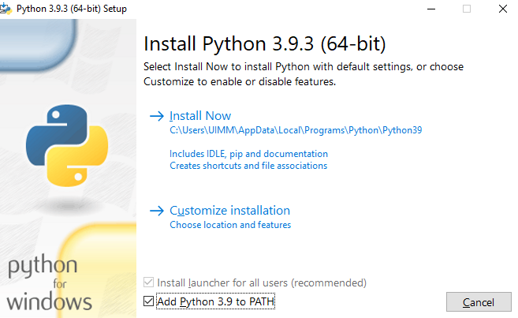

## Instalation Python
```bash
curl -O https://www.python.org/ftp/python/3.9.3/python-3.9.3-amd64.exe
```
```bash
python-3.9.3-amd64.exe
```
---------------------------------------------------------------------------------
__Cocher la case Add Python 3.9 to PATH__


----------------------------------------------------------------------------------
----------------------------------------------------------------------------------  
__Cliquer sur Install New__ 


```bash
'Accepter le par feu'
```

## Lancer l'application production
```bash
pythonC:\Users\UIMM\Desktop\ProjetPythonAAM-main\APP_PROD\main.py
```
