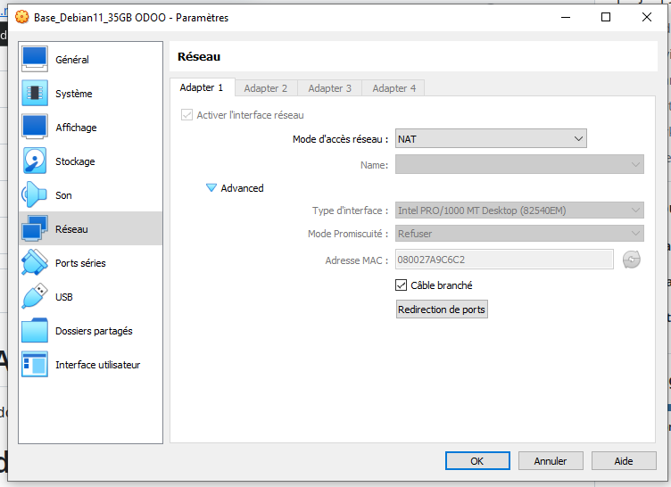
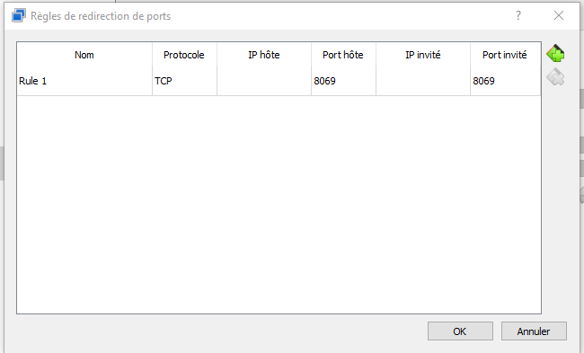
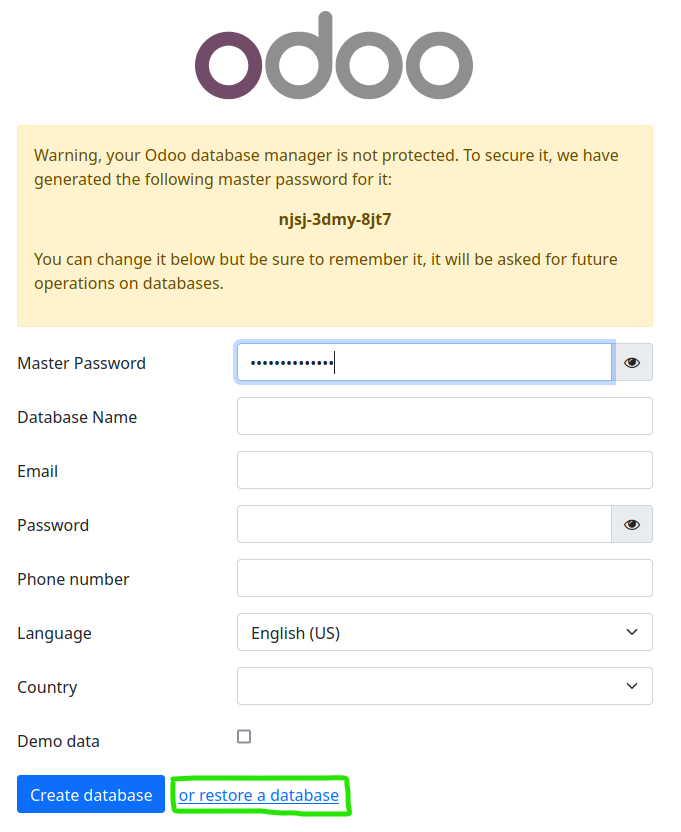
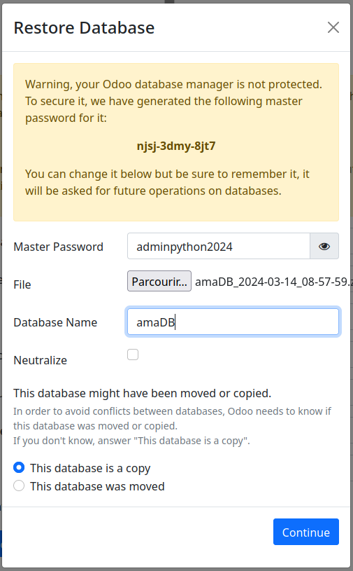

# Configuration du serveur
Installation du serveur Odoo sur le PC 1 (Linux)

## 1/ Configuration du réseaux de la VM
Vérifier si la VM est bien connecté au réseaux WIFI GUEST 
Vérifier la configuration du reseaux de la VM.  
 - Reseaux en NAT  
 - Ouvertures des ports 8069
  


## 2/ Mise en place de docker sur la VM linux debian 11
Vérifier si docker est pas déja installé sur la VM.

```bash
docker --version
```
Si docker existe déja passer à l'étape 3. Sinon suivre les instrcutions ci-dessous.
## Instalation des dépendances 
Dans la console mettre les commandes suivantes pour installer les dépendance :
```bash
sudo apt-get update
```
```bash
sudo apt-get install apt-transport-https ca-certificates curl gnupg2 software-properties-common
```
## Ajouter le dépôt officiel Docker
```bash
sudo curl -fsSL https://download.docker.com/linux/debian/gpg | sudo gpg --dearmor -o /usr/share/keyrings/docker-archive-keyring.gpg
```
```bash
sudo echo "deb [arch=amd64 signed-by=/usr/share/keyrings/docker-archive-keyring.gpg] https://download.docker.com/linux/debian $(lsb_release -cs) stable" | sudo tee /etc/apt/sources.list.d/docker.list
```
```bash
sudo apt-get update
```
## Installation des paquets Docker
```bash
sudo apt-get install docker-ce docker-ce-cli containerd.io
```
## Tester si docker est bien installé
```bash
sudo systemctl status docker
```
## Vérifier la version de docker
```bash
docker --version
```
## 3/ Installation de Portainer (interface graphique pour docker)
Mise en place du conteneur Portainer sur docker
```bash
docker run -d -p 9000:9000 --name portainer \
    --restart=always \
    -v /var/run/docker.sock:/var/run/docker.sock \
    -v portainer_data:/data \
    portainer/portainer-ce:latest
```
Verifier que portainer soit bien installé en allant sur : http://0.0.0.0:9000  

## 3/ Installation du stack odoo sur docker
Allez sur portainer via : http://0.0.0.0:9000 et installer le stack suivant  
créer un stack du nom de odoo70 en mettant la config suivante:  
```yml
version: '2'
services:
  web:
    image: odoo:16.0
    depends_on:
      - mydb
    ports:
      - "8069:8069"
    environment:
    - HOST=mydb
    - USER=odoo
    - PASSWORD=myodoo
  mydb:
    image: postgres:15
    environment:
      - POSTGRES_DB=postgres
      - POSTGRES_PASSWORD=myodoo
      - POSTGRES_USER=odoo
```
Valider puis attendre (environ 2min) l'installation des deux conteneurs odoo et postgreSQL vérifier la présence des deux conteneurs sur portainer.  
Vérifier l'accès au serveur Odoo en allant sur : http://0.0.0.0:8069   

## 4/ Mise en place la base de données sur odoo
Aller sur la page de connection odoo via: http://0.0.0.0:8069
Cliquer sur restore database
 

Remplir le mdp, le nom de la base de données et chosir le fichier ZIP puis importer la base de données
  

Connecter vous sur odoo via :
 - email : admin  
 - mdp : adminpython2024  
Vérifier l'apparition des articles sur la page web odoo. Pour valider la mise en place de la base de données.
