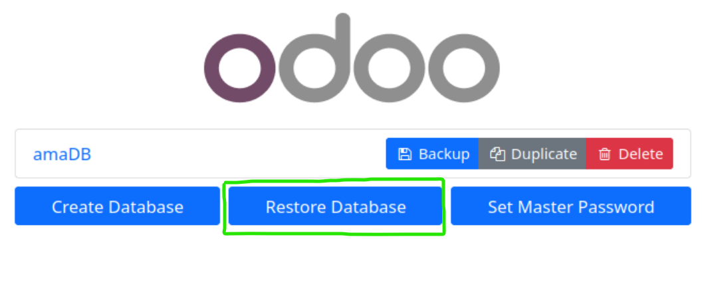
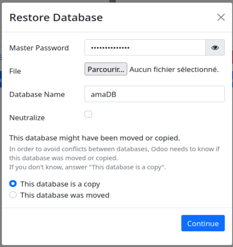

# Configuration du serveur

Nous devons créer sur une VM linux (debian) avec Docke avec les conteneurs Portainer, Odoo et postgresql.


# 1/ Configuration du réseaux de la VM
Connecter la VM au réseaux WIFI GUEST  
Dans la configuration du réseaux de la VM configurer le reseaux en NAT. et ouvrez les ports 8069:  


## 1/ Mise en place de docker sur la VM linux debian 11
Vérifier si docker est pas déja installé sur la VM.

```bash
docker --version
```
Si docker existe déja passer à l'étape X. Sinon suivre les instrcutions ci-dessous.
## Instalation des dépendances 
Dans la console mettre les commandes suivantes:
```bash
sudo apt-get update
```
```bash
sudo apt-get install apt-transport-https ca-certificates curl gnupg2 software-properties-common
```
## Ajouter le dépôt officiel Docker
```bash
sudo curl -fsSL https://download.docker.com/linux/debian/gpg | sudo gpg --dearmor -o /usr/share/keyrings/docker-archive-keyring.gpg
```
```bash
sudo echo "deb [arch=amd64 signed-by=/usr/share/keyrings/docker-archive-keyring.gpg] https://download.docker.com/linux/debian $(lsb_release -cs) stable" | sudo tee /etc/apt/sources.list.d/docker.list
```
```bash
sudo apt-get update
```
## Installation des paquets Docker
```bash
sudo apt-get install docker-ce docker-ce-cli containerd.io
```
## Tester si docker est bien installé
```bash
sudo systemctl status docker
```
## Vérifier la version de docker
```bash
docker --version
```
## 2/ Installation de Portainer (interface graphique pour docker)
## Mise en place du conteneur Portainer
```bash
docker run -d -p 9000:9000 --name portainer \
    --restart=always \
    -v /var/run/docker.sock:/var/run/docker.sock \
    -v portainer_data:/data \
    portainer/portainer-ce:latest
```
Verifier que portainer soit bien installé en allant sur :
```bash
http://0.0.0.0:9000
```
## 3/ Installation du stack odoo sur docker
Allez sur portainer via : http://0.0.0.0:9000 et installer le stack suivant
créer un stack du nom de odoo70 en mettant la config suivante:
```yml
version: '2'
services:
  web:
    image: odoo:16.0
    depends_on:
      - mydb
    ports:
      - "8069:8069"
    environment:
    - HOST=mydb
    - USER=odoo
    - PASSWORD=myodoo
  mydb:
    image: postgres:15
    environment:
      - POSTGRES_DB=postgres
      - POSTGRES_PASSWORD=myodoo
      - POSTGRES_USER=odoo
```
Valider puis attendre l'instalation des deux conteneurs odoo et base de données puis aller sur pour vérifier l'installation de portainer:
```bash
http://0.0.0.0:8069
```
## 4/ Mise en place la base de données sur odoo
Aller sur la page de connection odoo via: http://0.0.0.0:8069
Cliquer sur la base de données odoo  
  
Cliquer sur 'Gestion des bases de données Odoo' et restorer la base de données à l'aide du dossier ZIP 'amaDB_X'
  
  


## 5/ Mettre un contenneur en démarrage automatique dès le lancement de docker
Exemple pour portainer
```bash
sudo docker update --restart=always portainer
